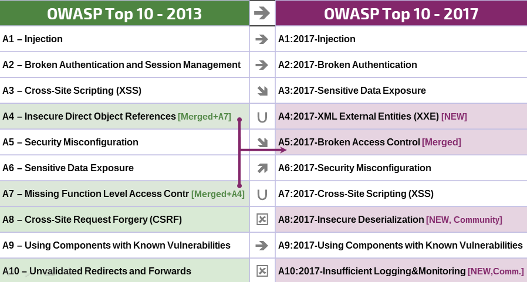

# RN ??Uppdateringsinformation??

## Ändringar från 2013 till 2017?

Förändringstakten har ökat de fyra senaste åren, därav behövde OWASP Topp 10 förändras. Vi har helrenoverat OWASP Topp 10, moderniserat metodiken, använt en ny process för informationsinsamling, samarbetat med ??rörelsen??, ändrat ordningen av riskerna, skrivit om varje riskbeskrivning från grunden och lagt till referenser till programmeringsramverk och -språk som används frekvent idag.

Under de senaste åren har den grundläggande teknologin och mjukvaruarkitekturen ändrats signifikant:

* Mikrotjänster utvecklade med node.js och Spring Boot ersätter traditionella monollitiska applikationer. Med mikrotjänster kommer nya säkerhetsutmaningar. Exempelvis hur förtroendet mellan mikrotjänster, containers, förvaltning av hemligheter, etc upprättas. Gammal kod som aldrig var tänkt att vara nåbar från internet exponeras nu via applikationsgränssnitt och REST-fulla webbtjänster. Dessa används i sin tur av enside-applikationer och appar i mobiltelefonen. Arkitekturella antaganden som görs i koden, som till exempel att lita på all anrop, gäller helt enkelt inte längre.
* Med s.k. enside-applikationer, utvecklade med JavaScript-ramverk såsom AngularJS och React, kan modulära och funktionsrika gränssnitt skapas. Funktioner som utförs på klienten istället för som traditionellt utförs på server-sidan för med sig nya säkerhetsutmaningar.
* JavaScript är numera det primära valet för webben med node.js på server-sidan och moderna ramverk såsom Bootstrap, Electron, AngularJS och React på klientsidan.

## Nya problem, baserat på insamlat data

* **A4:2017-XML External Entities (XXE)** är en ny kategori som primärt stöds av data från [kodgranskningsverktyg](https://www.owasp.org/index.php/Source_Code_Analysis_Tools).

## Nya problem, framtaget baserat på information från ??rörelsen??

Vi frågade ??rörelsen?? för att få en insikt i två framåtblickande sårbarhetskategorier. Med stöd av mer än 500 svar och bortplockning av kategorier baserade på data (som t.ex Sensitive Data Exposure och XXE) är de två nya problemen: 

* **A8:2017-Insecure Deserialization**, vilket tillåter s.k. ??remote code execution?? eller manipulation av objekt på vissa plattformar.
* **A10:2017-Insufficient Logging and Monitoring**, brist på dessa försvårar eller förhindrar upptäckandet av illvillig aktivitet, incidenthantering och digital forensik.

## Ihopslagna eller borttagna, men inte bortglömda

* **A4-Insecure Direct Object References** och **A7-Missing Function Level Access Control** slogs ihop till **A5:2017-Broken Access Control**.
* **A8-Cross-Site Request Forgery (CSRF)**, eftersom många ramverk inkluderar [försvar mot CSRF-attacker](https://www.owasp.org/index.php/Cross-Site_Request_Forgery_(CSRF))  hittades det bara i 5% av de undersökta applikationerna.
* **A10-Unvalidated Redirects and Forwards**, hittades i ungefär 8% av de undersökta applikationer men XXE kom snäppet före.

