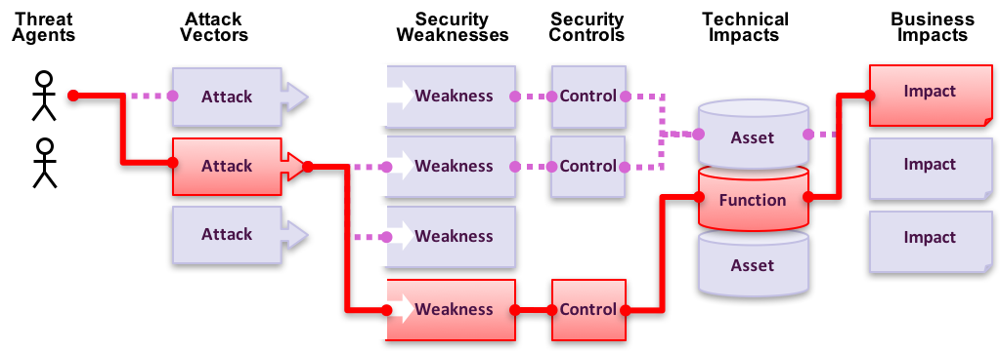

# Risk - Säkerhetsrisker i applikationer

## Vad är säkerhetsrisker i applikationer?

En attackerare kan potentiellt använda många olika vägar i din applikation för att skada din verksamhet eller organisation. Varje enskild väg representerar en risk som kanske, eller kanske inte, är tillräckligt allvarlig för att uppmärksammas.

Ibland är vägarna lätta att hitta och utnyttja, i andra fall kan det vara extremt svårt. På liknande sätt kan skadan som orsakas kanske inte har någon som helst konsekvens eller i värsta fall resultera i konkurs. För att kunna avgöra riskerna för din organisation krävs en utvärdering av sannolikheten för att något ska inträffa i varje del - hotbild, attackytor och ??svagheter?? i kombination med en uppskattning av teknisk inverkan och verksamhetspåverkan. Tillsammans avgör dessa faktorer den övergripande risken.

## Var är min risk?

[OWASP Topp 10](https://www.owasp.org/index.php/Top10) fokuserar på att identifiera de mest kritiska säkerhetsriskerna i webbapplikationer för en rad olika typer av organisationer. För varje enskild risk tillhandahålls allmän information om sannolikheten och teknisk inverkan genom att använda följande simpla betygssystem baserat på [OWASP Risk Rating Methodology](https://www.owasp.org/index.php/OWASP_Risk_Rating_Methodology).

| Hotbild       | Exploaterbarhet | ??Förekomst av svagheten?? | ??Upptäckbarhet av svagheten?? | Teknisk ??inverkan?? | ??Inverkan på verksamheten?? |
| ------------- | --------------- | -------------------------- | ------------------------------ | -------------------- | ---------------------------- |
| Applikations- | Lätt 3          | Välspridd 3                | Lätt 3                         | Allvarlig 3          | Verksamhets-                 |
| specifik      | Medel 2         | Vanlig 2                   | Medel 2                        | Måttlig 2            | specifik                     |
|               | Svårt 1         | Ovanlig 1                  | Svårt 1                        | Lindrig 1            |                              |

I denna utgåva har risksystemet uppdaterats för att underlätta framtagandet av sannolikheten och ??påverkan?? för varje given risk. För en mer detaljerad beskrivning se [Notis om risk](0xc0-note-about-risks.md).

Varje organisation är unik och så är även hotbilderna mot dem; hotbildernas mål och och ??inverkan?? av ev. intrång. Om t.ex. en organisation använder ett CMS (Content Management System) för publik information medan en annan använder precis samma CMS för att hantera känslig information som t.ex sjukvårdsjournaler kan hotbilderna och inverkan på verksamheten se väldigt olika ut trots att samma mjukvara används. En förståelse om hotbilderna och dess inverkan är kritisk för en organisation.

I den engelska varianten har namnen i Topp 10, där det varit möjligt, upprättats i enlighet med CWE ([Common Weakness Enumeration](https://cwe.mitre.org/)) för att bidra till en standard och på så sätt undvika missförstånd och förvirring. I den svenska varianten har namnen i Topp 10 tagits fram genom publik omröstning.

## Referenser

### OWASP

* [OWASP Risk Rating Methodology](https://www.owasp.org/index.php/OWASP_Risk_Rating_Methodology)
* [Article on Threat/Risk Modeling](https://www.owasp.org/index.php/Threat_Risk_Modeling)

### Externa

* [ISO 31000: Risk Management Std](https://www.iso.org/iso-31000-risk-management.html)
* [ISO 27001: ISMS](https://www.iso.org/isoiec-27001-information-security.html)
* [NIST Cyber Framework (US)](https://www.nist.gov/cyberframework)
* [ASD Strategic Mitigations (AU)](https://www.asd.gov.au/infosec/mitigationstrategies.htm)
* [NIST CVSS 3.0](https://nvd.nist.gov/vuln-metrics/cvss/v3-calculator)
* [Microsoft Threat Modelling Tool](https://www.microsoft.com/en-us/download/details.aspx?id=49168)
